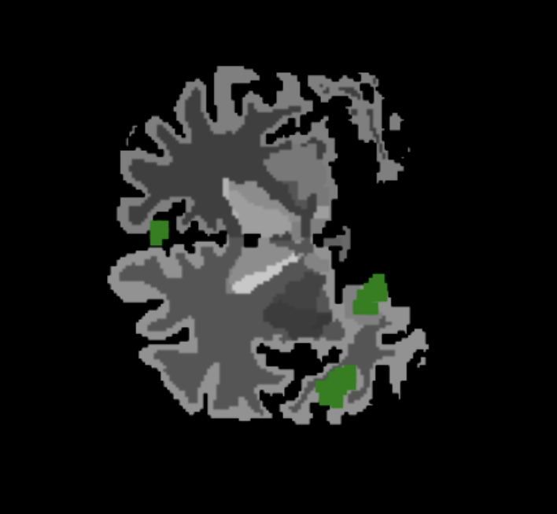

# Alzheimer-Classification
This repository contains the code and framework designed to classify Alzheimer's disease using multimodal data, including MRI images and patient demographics. I made this to experiment with and learn about pretrianed models, Neural Network frameworks, and computer vision. The pipline is composed of a 3D MRI segmentation model and a Rule based model to derive interpretability for a classification.

## Overview
The questions I aimed to address:

• How can I use expert knowledge to create more reliable NNs for patient diagnosis?

• How can I create NNs that explain their reasoning behind predictions and make the pro-  cess of diagnosis more transparent?

• How can I incorporate human feedback into the diagnosis model so that the model learns with the expert over time?

## Data Collection and Preprocessing 
The initial step of the pipeline involved selecting and pre-processing suitable data. Using 3D MRI scans from the OASIS dataset, I extracted features such as the volume, height, length, and width of various brain regions. However, these regions were not confined to traditional segments; the pipeline also derived features from structures like white matter and the optic chiasm, which are not strictly categorized as segments. I employed FreeSurfer, an open-source tool considered the gold standard for brain segmentation.

## Summary Statistics and Rule-Based Models 
I then focused on computing summary statistics for each brain segment, such as volume and thickness, to simplify interpretation. A Random Forest model trained on these features achieved an accuracy of 87%. While this was promising, it fell short of state-of-the-art performance. I also attempted rule extraction from the Random Forest model. However, as shown Figure 2, a smaller number of rules led to significant performance degradation, highlighting the complexity of the relationships in the data.

  

This model utlizies PySR, which was able to derive simple equations using constants and binary operators between features such as addition and subtraction for classification. Using this, I trained a model based off of the volume of brain segments as well as standard patient data such as age, normalized whole brain volume, and atlas scal- ing factor. I varied model size, loss function, and operations to find the best performing model. Large models they tended overfit, and too much randomness lead to inconsistent performance of the formulas. I achieved 83% accuracy with just five features. By creating an ensemble of 15 learned
formulas, I improved the model’s accuracy to 91%. Adding more models increased the accuracy at the cost of interpretability. To derive interpretability from these equations, I extracted the most
common features in the ensemble, ranking them by feature importance of each classification. I found that our rules-based models had much better performance than equivalently sized random
forest models or neural networks. I compared our models by training 30 formulas using PySr. I evaluated the performance of the ensemble of the first n models. I also trained random forest models with 1-30 estimators. I then trained neural network using all the data. In all cases I observed that our methods performed significantly better and used fewer features.

  

## Data
I have used the following datasets:
- [MRI and Alzheimer's Dataset on Kaggle](https://www.kaggle.com/datasets/jboysen/mri-and-alzheimers/code)
- [Alzheimer's Dataset and Discussion on Kaggle](https://www.kaggle.com/datasets/yasserhessein/dataset-alzheimer/discussion?sort=hotness)
